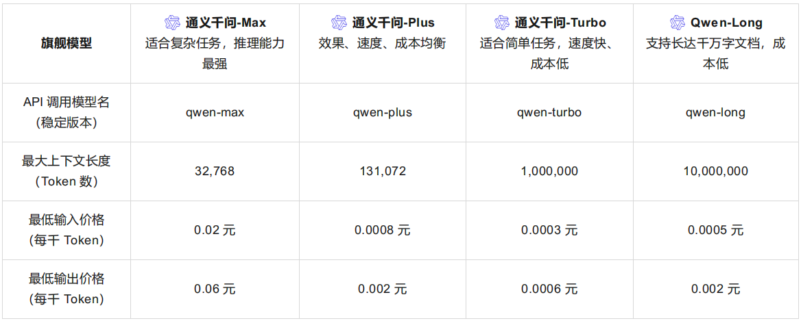

# 通义千问实验记录

## 通义千问模型

试验阶段选择**通义千问-Turbo**，这是通义千问系列速度最快、成本很低的模型，适合简单任务。
免费额度：100 万 Token，有效期：百炼开通后 30 天内，2024 年 9 月 19 日 0 点后开通百炼的用户，免费额度有效期为 180 天。

## 问题记录

1. 爬虫数据清洗，部分数据与交通评价无关或相关度不高，建议清除
2. 爬虫数据精简，部分数据正文过长，消耗 token，建议采取些限制
3.
