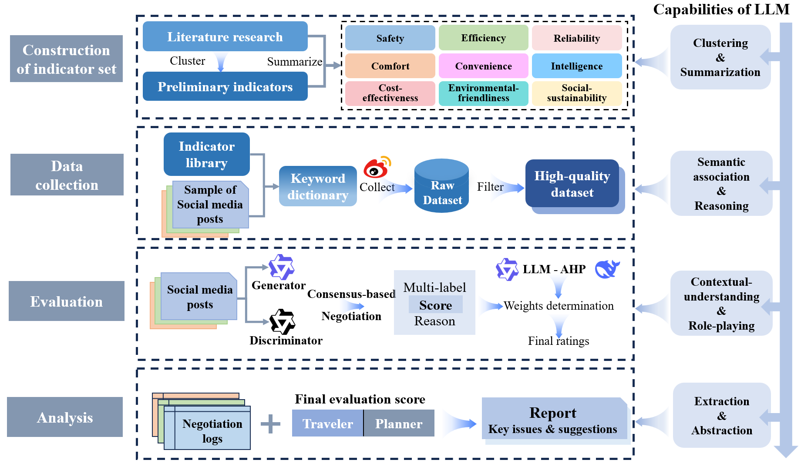

# Urban traffic evaluation with social media data -- 基于社交媒体的城市交通体验评估

Our work is published in *Transportation Research Part A: Policy and Practice* (DOI: https://doi.org/10.1016/j.tra.2026.104980)

citation format (bibTex):
```
@article{LI2026104980,
title = {Urban traffic evaluation with social media data: A consensus-based LLM negotiation paradigm},
journal = {Transportation Research Part A: Policy and Practice},
volume = {208},
pages = {104980},
year = {2026},
issn = {0965-8564}
}
```


## Methodology

**LLM-enhanced data collection and cleaning procedure $\rightarrow$ High-quality corpus.**

**LLM negotiation-based urban travel experience evaluation: Dual perspective from both travelers and urban planners.**




