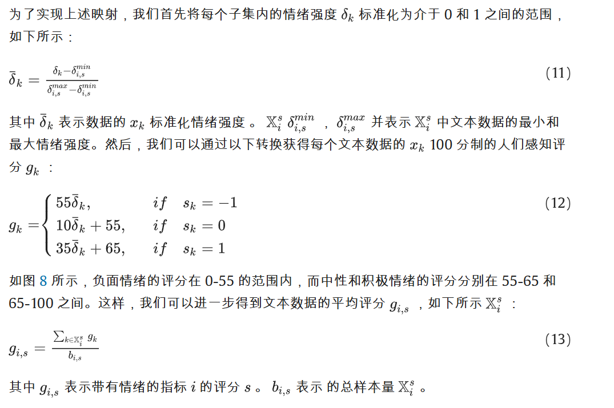

# TrafficEcho 交通情况评估

## 项目架构

- LLM
  大模型分析部分
  - 大模型选用通义千问，选型为**通义千问-Turbo**
  - Kimi 由于并发限制，暂时弃用
  - 通义千问实验记录：
- Spider
  爬虫数据抓取部分

## 讨论记录
### 20250118(腾讯会议)
#### 一、工作流程：
1、	在服务器上配环境\
2、	确定爬虫关键词，爬2023-2024两年的数据\
3、	清洗数据（广告、官方号等）-> 有效数据集\
4、	将数据集分成不同的类（分类关键词如何生成？一句话中的分类要全面。）\
5、	用通义大模型来对每个类别下判断情感极性（要不要标注一部分？）\
6、	每个类别下的情感强度 -> 类内每句话有一个针对该类的评分 -> 大类的分\
7、	类间权重靠大模型“专家打分”（整个过程中用哪些模型？前后要一致）
#### 二、从四篇LLM的论文可以学到的：
1、	数据增强：正则化等方法\
2、	大模型对指标和文献进行分类\
3、	提示词的改进\
4、	不同的模型之间的“生成对抗”：一个模型来判别，另一个来判断“判断的对不对”\
5、	多模型之间的横向对比

### 20241209(通达馆662)
1、根据文献一级二级指标整理分类指标\
2、指标分界明确，给词聚类\
3、先分正面、负面、中性（通过提示词）满意度\
4、不同大模型“专家权重”对比\
5、bert和大模型的对比优势\

## 实验记录
### 20241202

- [x] 评分标准简单修改，问题：中性内容范围较广，情感强度
- [ ] 评分体系，大模型知识库构建。大模型直接评分还是给定一个复杂些的数学公式
- [ ] 先不评分，分快

### 20241129

- [x] 爬虫数据批量处理，验证通义千问模型效率及质量，383 条，关键词分类太细
- [x] Token 记录，383 条，消耗 Token 178172，￥ 0.108
- [ ] 数据清洗，文本长度，数据有效判断，广告、水军...
- [ ] 爬虫 IP 代理池，Cookie
- [ ] 评分标准，分类方式
- [ ] 上传了 2023 年完整的基于关键词“内环/中环/外环 堵”的数据以供模型测试使用(1201)

### 20241126

- data 包含两个关键词词库产生的两个语料库，语料库 2 中“驾驶 安全”包含较多广告，若无法处理可删除

### 20241123

- 通义千问模型调用实现
- 原始代码上传
