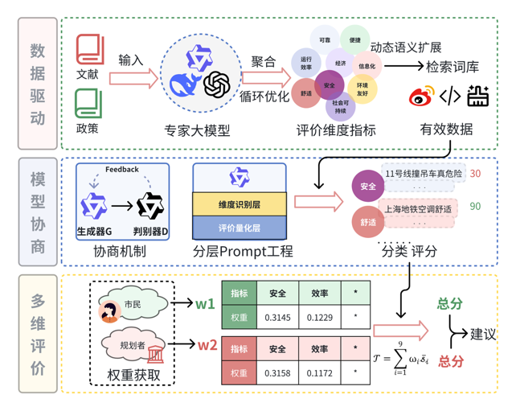

# TrafficEcho 交通情况评估

## 技术路线

## 讨论记录
### 2025.2-2025.3.12
**内容:**
-[x] 1、分类(协商)
-[x] 2、评分(协商)
-[x] 3、权重(协商)
-[x] 4、出分(本质也是协商)
-[x] 5、验证协商机制的有效性 
-[x] 6、写答辩的文档和PPT制作
-[ ] 7、讲故事至今仍未
### 20250220(19:30腾讯会议)
**要点：**
- 增强模型的推理能力，让一个小参数的模型在微调之后有大参数模型的能力。
- 讲好推理和分类之间的关系，让小参数模型的推理能力更强。
- 打分的权重让大模型协商。
**接下来：**
- 流程跑通（！！！！！ddl开学一周）
- 讲故事告诉大家哪里好？（指标好？模型好？微调好？分类准）
- 提炼出方法论？
- 经费怎么报销？

### 20250126(21:00腾讯会议)
**一、讨论内容**\
1、论文交流
- 指标怎么生成？ 对比学姐文章，先输入原始指标，再给大模型喂一系列关键词，根据新的关键词，检查优化原始指标，得到新的指标库。
- 还可以喂伪数据进行示例供大模型调整。
- 这个过程提示词prompt比较重要。

2、数据处理，明确有效数据数量。

3、处理后的语料库，某些搜索词的条数太多，太少的数据量会如何影响分类过程和评价结果？（某种指标的数据太少）

4、人工标注指标分类。大模型最终对某条数据给出的分类，理论上可能是涉及多个分类的，但这样似乎在检验准确率时不太方便，所以只给出最高相关度的指标类别。

### 20250121(15:00腾讯会议)
**一、寒假工作：**
- [x] 1、阅读"LLM+"和大模型文本分类的相关内容
- [x] 2、年前再进行一次讨论明确上次讨论需要完善的流程上的细节
- [x] 3、尝试跑通部分流程。
- [ ] （最重要）讲出完整的方案和故事

#### 二、讨论内容：
1、项目**创新点**？
- ***多维度的情感评价，在模糊的评价语言中聚类出清晰的指标，并且能够量化。***
- ***在利用社交媒体数据进行某专业领域的评价时，如果想进行多维度的评价，将文本数据准确分类到不同维度指标上也是值得讨论解决的问题***

2、我们要解决的是什么问题？为什么一定要用大模型解决？怎么验证基于大模型的解决方案有效？\
3、为什么你的方案比别人好？为什么要这么微调/协商？和什么方法比？（bert？还是什么？）对业界的贡献是什么？（从头到尾讲好故事）

### 20250118(21:00腾讯会议)
**一、工作流程：**
- [x] 1、 在服务器上配环境
- [x] 2、	确定爬虫关键词，爬2023-2024两年的数据
- [x] 3、	清洗数据（广告、官方号等）-> 有效数据集
- [x] 4、	将数据集分成不同的类（分类关键词如何生成？一句话中的分类要全面。）
- [x] 5、	用通义大模型来对每个类别下判断情感极性（要不要标注一部分？）
- [x] 6、	每个类别下的情感强度 -> 类内每句话有一个针对该类的评分 -> 大类的分
- [x] 7、	类间权重靠大模型“专家打分”（整个过程中用哪些模型？前后要一致）

**二、从四篇LLM的论文可以学到的：**\
1、	数据增强：正则化等方法\
2、	大模型对指标和文献进行分类\
3、	提示词的改进\
4、	不同的模型之间的“生成对抗”：一个模型来判别，另一个来判断“判断的对不对”\
5、	多模型之间的横向对比

### 20241209(通达馆662)
1、根据文献一级二级指标整理分类指标\
2、指标分界明确，给词聚类\
3、先分正面、负面、中性（通过提示词）满意度\
4、不同大模型“专家权重”对比\
5、bert和大模型的对比优势

## 实验记录
### 20241202

- [x] 评分标准简单修改，问题：中性内容范围较广，情感强度
- [x] 评分体系，大模型知识库构建。大模型直接评分还是给定一个复杂些的数学公式
- [x] 先不评分，分类

### 20241129

- [x] 爬虫数据批量处理，验证通义千问模型效率及质量，383 条，关键词分类太细
- [x] Token 记录，383 条，消耗 Token 178172，￥ 0.108
- [x] 数据清洗，文本长度，数据有效判断，广告、水军...
- [x] 爬虫 IP 代理池，Cookie
- [x] 评分标准，分类方式
- [x] 上传了 2023 年完整的基于关键词“内环/中环/外环 堵”的数据以供模型测试使用(1201)

### 20241126

- data 包含两个关键词词库产生的两个语料库，语料库 2 中“驾驶 安全”包含较多广告，若无法处理可删除

### 20241123

- 通义千问模型调用实现
- 原始代码上传
